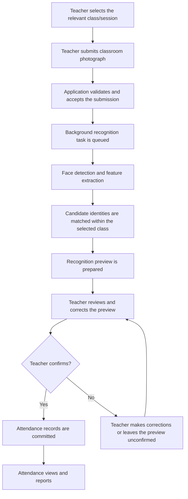

# Attendance workflow (Mermaid)

```mermaid
flowchart TD
    A[Teacher selects the relevant class/session] --> B[Teacher submits classroom photograph]
    B --> C[Application validates and accepts the submission]
    C --> D[Background recognition task is queued]
    D --> E[Face detection and feature extraction]
    E --> F[Candidate identities are matched within the selected class]
    F --> G[Recognition preview is prepared]
    G --> H[Teacher reviews and corrects the preview]
    H --> I{Teacher confirms?}
    I -- Yes --> J[Attendance records are committed]
    I -- No --> K[Teacher makes corrections or leaves the preview unconfirmed]
    K --> H
    J --> L[Attendance views and reports]
```

The workflow depicts the product concept, not exact endpoint behavior or implementation logic.
